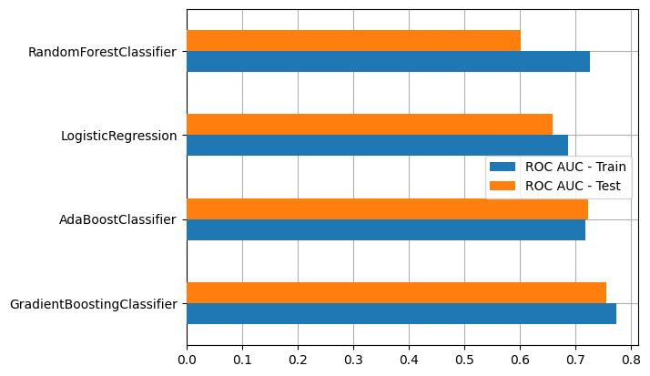

# Laporan Proyek Machine Learning - Muhammad Fathul Radhiansyah

## Domain Proyek

**Latar Belakang**

Dalam industri perjalanan dan pariwisata, asuransi perjalanan memiliki peran penting dalam memberikan perlindungan untuk berbagai risiko terkait perjalanan, seperti pembatalan perjalanan, keadaan darurat medis, kehilangan bagasi, dan penundaan penerbangan. Namun, tingkat konversi asuransi perjalanan seringkali rendah, sehingga memahami perilaku dan preferensi pelanggan menjadi kunci untuk meningkatkan penjualan asuransi perjalanan.

Proyek ini bertujuan untuk mengembangkan model prediksi asuransi perjalanan yang dapat memprediksi apakah pelanggan akan membeli asuransi perjalanan atau tidak berdasarkan berbagai fitur. Model ini akan membantu agen perjalanan dan perusahaan asuransi untuk mengidentifikasi pelanggan potensial, mempersonalisasi produk asuransi mereka, dan meningkatkan tingkat konversi.

**Mengapa dan Bagaimana Masalah Ini Harus Diselesaikan?**

Tingkat konversi asuransi perjalanan yang rendah menunjukkan perlunya pemahaman lebih dalam tentang perilaku pelanggan dan faktor-faktor yang memengaruhi keputusan pembelian mereka. Analisis terhadap fitur-fitur demografis dan terkait perjalanan pelanggan dapat memberikan wawasan yang berharga untuk meningkatkan efektivitas kampanye pemasaran dan penjualan asuransi perjalanan.

Namun, menganalisis fitur-fitur ini secara manual untuk setiap pelanggan dapat menjadi proses yang lambat dan rentan terhadap kesalahan. Oleh karena itu, pengembangan model prediksi yang otomatis dan akurat sangat diperlukan untuk mengidentifikasi pola-pola yang tersembunyi dalam data dan memprediksi kecenderungan pembelian pelanggan.

Referensi: [Predicting Travel Insurance Purchases in an Insurance Firm through Machine Learning Methods after COVID-19](https://www.researchgate.net/publication/373895975_Predicting_Travel_Insurance_Purchases_in_an_Insurance_Firm_through_Machine_Learning_Methods_after_COVID-19)

## Business Understanding

### Problem Statements
Berdasarkan kondisi yang telah diuraikan sebelumnya, perusahaan akan mengembangkan sistem prediksi asuransi perjalanan untuk menjawab permasalahan berikut:

- Fitur-fitur mana yang memiliki dampak paling signifikan terhadap keputusan nasabah untuk membeli asuransi perjalanan?
- Dapatkah kita memprediksi dengan akurasi tinggi apakah seorang nasabah akan membeli asuransi perjalanan berdasarkan fitur-fitur yang telah diidentifikasi?

### Goals
Untuk menjawab pertanyaan tersebut, kita memiliki tujuan sebagai berikut:

- Mengidentifikasi fitur-fitur yang memiliki dampak paling signifikan terhadap keputusan pembelian asuransi perjalanan.
- Mengembangkan model pembelajaran mesin yang dapat memprediksi dengan akurasi tinggi apakah seorang nasabah akan membeli asuransi perjalanan berdasarkan fitur-fitur yang telah diidentifikasi.

## Data Understanding
Data yang digunakan dalam proyek ini berasal dari "Travel Insurance Prediction Data" yang diunduh dari <a href="https://www.kaggle.com/datasets/tejashvi14/travel-insurance-prediction-data">Kaggle API</a>. Dataset ini terdiri dari 1987 baris dengan 9 fitur, termasuk fitur non-numerik seperti Employment Type, GraduateOrNot, FrequentFlyer, dan EverTravelledAbroad, serta fitur numerik seperti Age, AnnualIncome, FamilyMembers, dan ChronicDiseases. Fitur target adalah TravelInsurance.

Berikut adalah fitur-fitur pada dataset Travel Insurance:

- Age: Usia Pelanggan
- Employment Type: Sektor tempat Pelanggan bekerja
- GraduateOrNot: Apakah Pelanggan lulus kuliah atau tidak
- AnnualIncome: Pendapatan tahunan Pelanggan dalam Rupee India [Dibulatkan ke Nearest 50 Ribu Rupee]
- FamilyMembers: Jumlah anggota dalam keluarga Pelanggan
- ChronicDiseases: Apakah Pelanggan menderita penyakit atau kondisi kronis seperti diabetes/tekanan darah tinggi atau asma, dll.
- FrequentFlyer: Riwayat perjalanan pesawat Pelanggan dalam 2 tahun terakhir (2017-2019), apakah sering bepergian dengan pesawat atau tidak
- EverTravelledAbroad: Apakah Pelanggan pernah bepergian ke luar negeri atau tidak
- TravelInsurance: Apakah Pelanggan membeli asuransi perjalanan atau tidak

### Exploratory Data Analysis (EDA)

Pada tahap EDA, dilakukan beberapa teknik visualisasi dan analisis univariat dan multivariat untuk memahami data lebih dalam:

- **Countplot pada Data Kategori**: Mayoritas pelanggan bekerja di sektor swasta, telah lulus kuliah, tidak memiliki status FrequentFlyer, dan tidak pernah melakukan perjalanan ke luar negeri.
- **Histplot pada Data Numerik**: Mayoritas pelanggan berusia sekitar 28 tahun, dengan pendapatan tahunan berkisar antara 300.000 hingga 1.800.000 rupee, dan memiliki 3 hingga 5 anggota keluarga.
- **Barplot Stacked pada Data Kategori dengan Hue TravelInsurance**: Pelanggan yang pernah melakukan perjalanan ke luar negeri cenderung lebih membeli asuransi perjalanan.
- **Pairplot dan Heatmap Correlation pada Data Numerik**: Terdapat korelasi positif yang rendah hingga sedang antara Age, AnnualIncome, dan FamilyMembers dengan keputusan pembelian asuransi perjalanan (TravelInsurance). Korelasi negatif yang rendah terlihat pada fitur ChronicDiseases.

## Data Preparation

Proses persiapan data sangat penting dalam pengembangan model prediktif. Berikut adalah langkah-langkah yang dilakukan dalam proses persiapan data:

- **Drop Data Duplikat**: Terdapat 738 baris data duplikat yang perlu dihapus untuk menghindari bias dalam model.
- **Encoding Data Kategorikal**: Fitur-fitur kategorikal diubah menjadi representasi numerik agar dapat digunakan dalam model pembelajaran mesin.
- **Pemisahan Data Train dan Test**: Data dibagi menjadi set pelatihan dan pengujian dengan proporsi 80:20.
- **Oversampling dengan Metode SMOTE**: Menyeimbangkan jumlah sampel antara kelas mayoritas dan minoritas menggunakan SMOTE.
- **Standarisasi Fitur Numerik**: Fitur Age, FamilyMembers, dan AnnualIncome distandarisasi agar memiliki skala yang serupa.

## Modeling

Pada tahap pemodelan, digunakan beberapa algoritma sebagai berikut:

- **Logistic Regression**: Cocok untuk klasifikasi biner dengan interpretasi yang mudah, namun cenderung kurang fleksibel dalam menangani hubungan yang kompleks.
- **RandomForestClassifier**: Ensambel pohon keputusan yang mampu menangani data tidak terstruktur, namun kompleksitas modelnya lebih tinggi.
- **GradientBoostingClassifier**: Ensambel pohon keputusan yang memperbaiki kesalahan secara berurutan, dapat menangani data yang tidak teratur, namun cenderung overfit jika tidak diatur dengan baik.
- **AdaBoostClassifier**: Ensambel pohon keputusan yang memberikan bobot pada sampel yang salah diklasifikasi pada iterasi sebelumnya, cocok untuk menangani data tidak seimbang namun rentan terhadap noise dan outlier.

Model GradientBoostingClassifier dipilih sebagai model terbaik dengan matriks evaluasi yang lebih tinggi, terutama pada matriks ROC AUC dengan skor 77%, menggunakan teknik Cross Validation pada data training.

## Evaluation

Matriks evaluasi yang digunakan meliputi Accuracy, Precision, Recall, F1 Score, dan ROC AUC. ROC AUC dipilih sebagai matriks evaluasi utama karena kemampuannya dalam mengukur false positif dan false negatif, yang penting dalam kasus klasifikasi yang tidak seimbang.

Dengan memperhatikan matriks evaluasi ini, model klasifikasi terbaik dapat dipilih berdasarkan kinerjanya dalam memisahkan kelas positif dan negatif. Model dengan ROC AUC yang lebih tinggi dianggap lebih baik dalam memprediksi keputusan pembelian asuransi perjalanan.

Berdasarkan hasil evaluasi data training, model GradientBoostingClassifier terpilih sebagai model terbaik dengan matriks evaluasi yang lebih tinggi, terutama pada matriks ROC AUC dengan skor pengujian sebesar 75% dan skor pelatihan sebesar 77%. Analisis lebih lanjut menunjukkan bahwa fitur AnnualIncome, FamilyMembers, dan Age memiliki kontribusi signifikan dalam memprediksi keputusan pembelian asuransi perjalanan.
